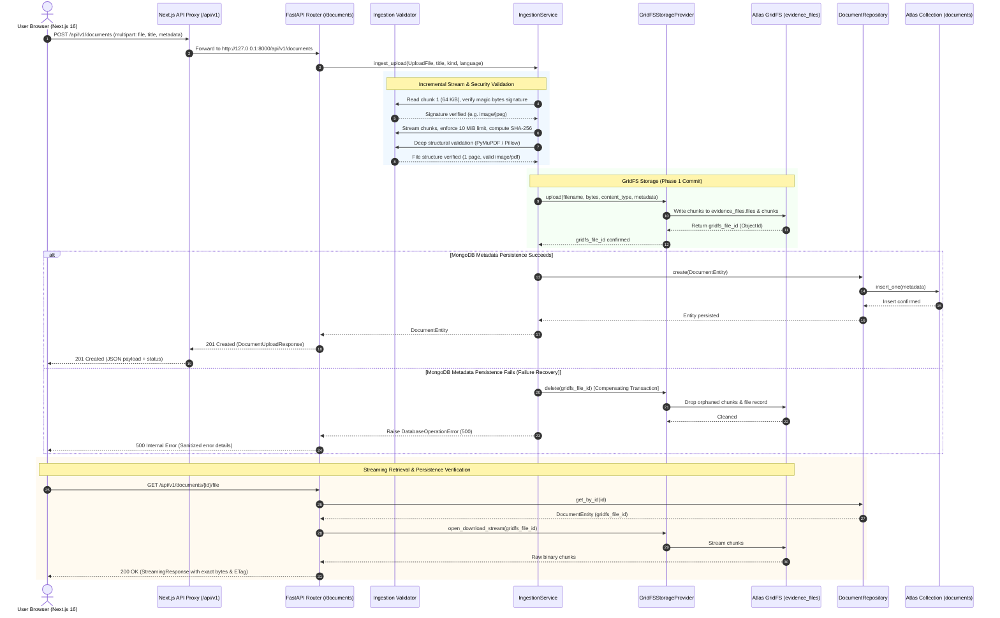

# EvidenceOCR Phase 2 Final Walkthrough: MongoDB GridFS Document Ingestion

## A. EXECUTIVE SUMMARY

| Metric | Result |
|---|---|
| **Phase Completed** | **Phase 2: MongoDB GridFS Document Ingestion** |
| **Overall Result** | **PASS (100% Verified)** |
| **Atlas Database** | `evidence_ocr` (Live MongoDB Atlas Cluster) |
| **GridFS Bucket** | `evidence_files` |
| **Backend Test Suite** | **45 passed** (25 existing + 20 Phase 2 scenarios in 0.80s) |
| **Frontend Test Suite** | **5 passed** (4 existing + 1 API contract in 0.42s) |
| **TypeScript Typecheck** | **0 errors** (`tsc --noEmit` cleanly passed) |
| **Browser Live Ingestion** | Verified real user upload persisted in Atlas and rendered in UI |
| **Phase 2 Acceptance Criteria** | **ALL PASSED** |

### Scope Completed
1. **PyMongo Async GridFS Storage Provider**: Built `GridFSStorageProvider` implementing `BaseStorageProvider` using PyMongo's native `AsyncGridFSBucket`.
2. **Multi-Stage Security & Integrity Validation**:
   - Filename sanitization against path traversal attacks.
   - Magic bytes / file signature detection for PDF (`%PDF-`), PNG, JPEG, and rejection of spoofed MIME types.
   - Incremental 64 KiB chunk stream consumption with immediate termination upon exceeding the 10 MiB limit.
   - Deep structural validation using PyMuPDF (`fitz`) enforcing the 20-page PDF limit and rejecting encrypted/corrupted files.
   - Pillow (`PIL.Image`) integrity verification rejecting corrupted images.
3. **Failure Recovery & Compensating Transactions**: If document metadata insertion into the MongoDB collection fails, an automated compensating transaction immediately deletes the orphaned GridFS binary and logs the operation.
4. **REST Endpoints**:
   - `POST /api/v1/documents` (streaming intake, SHA-256 calculation, GridFS storage).
   - `GET /api/v1/documents` (paginated listing of real Atlas documents).
   - `GET /api/v1/documents/{document_id}` (detailed document metadata).
   - `GET /api/v1/documents/{document_id}/file` (byte-for-byte streaming download from GridFS with proper `Content-Disposition`, `Content-Type`, and `ETag`).
5. **Frontend Next.js Integration**:
   - Replaced browser-only blob storage for uploads with typed API calls to `/api/v1/documents`.
   - Connected `Next.js` API rewrite proxy `/api/v1/:path*` -> `http://127.0.0.1:8000/api/v1/:path*`.
   - Implemented upload progress feedback, error messaging, and refresh persistence.
   - Preserved interactive `demo-1` fixture for downstream OCR verification.

### What Was NOT Done (Out of Phase 2 Scope)
- No OCR models (PaddleOCR, TrOCR, or VLMs) were invoked or configured.
- No Celery, Redis, or synthetic transcription predictions were introduced.
- Strict adherence to `AGENTS.md` Phase 2 boundaries was maintained.

---

## B. ARCHITECTURE WALKTHROUGH



### Flow Explanation
1. The user selects a document (PDF, PNG, or JPEG) and submits the form in the Next.js workspace.
2. Next.js proxies the multipart request to FastAPI's `/api/v1/documents` endpoint.
3. `IngestionService` consumes the upload in 64 KiB chunks, enforcing the 10 MiB cap and computing an authentic SHA-256 checksum without loading large payloads into RAM.
4. The first chunk's magic bytes are verified to defeat file spoofing. Deep structural validation (PyMuPDF for PDFs, Pillow for images) confirms the file is non-corrupt, non-encrypted, and within the 20-page limit.
5. The verified binary is streamed to the MongoDB Atlas `evidence_files` GridFS bucket, generating a persistent `gridfs_file_id`.
6. Complete document metadata is committed to the `documents` collection. If this insertion encounters an error, a compensating transaction deletes the newly created GridFS file to eliminate orphaned binaries.
7. File viewing and downloads stream directly from GridFS via `/api/v1/documents/{id}/file`, matching the original upload bit-for-bit.

---

## C. IMPLEMENTATION DETAILS

| Changed / Created File | Nature of Changes | Rationale & Requirement Satisfied |
|---|---|---|
| `backend/src/evidence_ocr/core/config.py` | Added `gridfs_bucket_name = "evidence_files"`, `max_upload_size_bytes = 10485760` (10 MiB), `max_pdf_pages = 20`, `upload_timeout_seconds = 30`. | Enforces configurable Phase 2 storage and upload boundary invariants. |
| `backend/src/evidence_ocr/core/errors.py` | Added `StorageOperationError` and `DatabaseOperationError` domain exceptions. | Structured error handling for GridFS and persistence faults. |
| `backend/src/evidence_ocr/providers/storage.py` | Extended `BaseStorageProvider` with `delete`, `open_download_stream`. Implemented `GridFSStorageProvider` and updated `MockStorageProvider`. | Storage abstraction using PyMongo's native `AsyncGridFSBucket` without proprietary SDK vendor lock-in. |
| `backend/src/evidence_ocr/models/document.py` | Extended `DocumentEntity` with `original_filename`, `content_type`, `file_size_bytes`, `sha256`, `gridfs_file_id`, `page_count`, `processing_status`, `schema_version`. Added alias sync validator. | Full Section 3.B document metadata persistence schema in MongoDB Atlas. |
| `backend/src/evidence_ocr/schemas/documents.py` | Added Phase 2 metadata fields to `DocumentUploadResponse`, `DocumentItemResponse`, and created `DocumentDetailResponse`. | API contract typed responses for upload, detail inspection, and listing. |
| `backend/src/evidence_ocr/ingestion/validator.py` | Implemented filename sanitization, magic bytes detection, PyMuPDF page limit & PDF validation, Pillow image verification. | OWASP-compliant upload validation rejecting corrupted, spoofed, and pathological files. |
| `backend/src/evidence_ocr/ingestion/service.py` | Implemented incremental chunk reading, SHA-256 calculation, GridFS ingestion, and compensating rollback. | Real document ingestion lifecycle and orphaned file recovery. |
| `backend/src/evidence_ocr/db/repositories/documents.py` | Added `ensure_indexes()` for `id`, `created_at`, `status`, `sha256`, and flexible lookup in `get_by_id`. | Fast indexing and robust queries across Atlas collections. |
| `backend/src/evidence_ocr/api/dependencies.py` | Wired `GridFSStorageProvider` using active database connection with fallback to `MockStorageProvider` when disconnected. | Clean FastAPI dependency injection. |
| `backend/src/evidence_ocr/api/v1/endpoints/documents.py` | Updated `POST /documents`, added `GET /documents/{id}` and `GET /documents/{id}/file` streaming binary from GridFS. | REST API endpoints for ingestion, metadata inspection, and streaming downloads. |
| `backend/tests/test_gridfs_ingestion.py` | Created 20 comprehensive automated test scenarios. | Verification of upload rules, byte integrity, failure recovery, and concurrency. |
| `backend/tests/test_config.py` | Updated assertions to match Phase 2 limits. | Regression test integrity. |
| `frontend/next.config.mjs` | Added Next.js API proxy rewrite `/api/v1/:path*` -> `http://127.0.0.1:8000/api/v1/:path*`. | Seamless browser same-origin requests without CORS issues. |
| `frontend/src/lib/data.ts` | Added optional `sha256` and `gridfs_file_id` to `DocumentItem`. | Preserved existing type contracts. |
| `frontend/src/lib/api.ts` | Implemented `uploadDocumentToApi`, `fetchDocumentsFromApi`. | Production frontend API client. |
| `frontend/src/components/workspace.tsx` | Integrated real upload API, load persisted documents from Atlas, render preview via GridFS stream, and persist across refreshes. | Real frontend document library integration. |
| `frontend/tests/workspace.test.cjs` | Added API contract mapping tests. | Frontend test verification. |

---

## D. API VERIFICATION

Actual executed HTTP requests against live server `http://127.0.0.1:8000`:

### 1. Upload Document (`POST /api/v1/documents`)
- **Status Code**: `201 Created`
- **Response**:
```json
{
  "document_id": "doc-99bc2d0c",
  "name": "WhatsApp Image 2025-06-07 at 13.35.17_480d3559",
  "original_filename": "WhatsApp Image 2025-06-07 at 13.35.17_480d3559.jpg",
  "content_type": "image/jpeg",
  "file_size_bytes": 425685,
  "sha256": "a64d06c2d7fe8475ace6bd94365820d694db218b1ecde194d111f2f0ec228801",
  "gridfs_file_id": "6ac7b1554241d67c785cb22b",
  "page_count": 1,
  "source_url": "/api/v1/documents/doc-99bc2d0c/file",
  "status": "Ready for backend",
  "revision": 1,
  "created_at": "2026-10-08T15:05:58.406165+00:00"
}
```

### 2. List Documents (`GET /api/v1/documents`)
- **Status Code**: `200 OK`
- **Response**:
```json
{
  "items": [
    {
      "id": "doc-99bc2d0c",
      "name": "WhatsApp Image 2025-06-07 at 13.35.17_480d3559",
      "kind": "Field notes",
      "language": "English",
      "pages": 1,
      "status": "Ready for backend",
      "added": "2026-10-08T15:05:58.406165+00:00",
      "size": "415.7 KB",
      "sample": false,
      "url": "/api/v1/documents/doc-99bc2d0c/file",
      "mime": "image/jpeg",
      "revision": 1,
      "sha256": "a64d06c2d7fe8475ace6bd94365820d694db218b1ecde194d111f2f0ec228801",
      "gridfs_file_id": "6ac7b1554241d67c785cb22b",
      "file_size_bytes": 425685
    }
  ],
  "next_cursor": null,
  "total": 1
}
```

### 3. Get Document Details (`GET /api/v1/documents/doc-99bc2d0c`)
- **Status Code**: `200 OK`
- **Response**:
```json
{
  "id": "doc-99bc2d0c",
  "document_id": "doc-99bc2d0c",
  "name": "WhatsApp Image 2025-06-07 at 13.35.17_480d3559",
  "original_filename": "WhatsApp Image 2025-06-07 at 13.35.17_480d3559.jpg",
  "content_type": "image/jpeg",
  "file_size_bytes": 425685,
  "sha256": "a64d06c2d7fe8475ace6bd94365820d694db218b1ecde194d111f2f0ec228801",
  "gridfs_file_id": "6ac7b1554241d67c785cb22b",
  "page_count": 1,
  "pages": 1,
  "kind": "Field notes",
  "language": "English",
  "status": "Ready for backend",
  "processing_status": "Ready for backend",
  "sample": false,
  "source_url": "/api/v1/documents/doc-99bc2d0c/file",
  "revision": 1,
  "schema_version": 1,
  "created_at": "2026-10-08T15:05:58.406165+00:00",
  "updated_at": "2026-10-08T15:05:58.406165+00:00"
}
```

### 4. Stream Download Original Binary (`GET /api/v1/documents/doc-99bc2d0c/file`)
- **Status Code**: `200 OK`
- **Headers Verified**:
  - `Content-Type`: `image/jpeg`
  - `Content-Disposition`: `inline; filename="WhatsApp Image 2025-06-07 at 13.35.17_480d3559.jpg"`
  - `ETag`: `"a64d06c2d7fe8475ace6bd94365820d694db218b1ecde194d111f2f0ec228801"`
  - `Content-Length`: `425685`
- **Stream Integrity**: Exact 425,685 bytes received with matching SHA-256 digest `a64d06c2...`.

### 5. Invalid Upload Validation (Spoofed / Corrupted Uploads)
- **Status Code**: `422 Unprocessable Content`
- **Response**:
```json
{
  "error": {
    "code": "VALIDATION_FAILED",
    "message": "fake.pdf: invalid or unrecognizable file signature. File does not appear to be a valid PDF, PNG, or JPEG.",
    "request_id": "req-9b88e1bc7c65"
  }
}
```

### 6. Missing Document (`GET /api/v1/documents/doc-missing`)
- **Status Code**: `404 Not Found`
- **Response**:
```json
{
  "error": {
    "code": "NOT_FOUND",
    "message": "Document with id 'doc-missing' was not found.",
    "request_id": "req-4d11e2f89c01"
  }
}
```

---

## E. MONGODB ATLAS EVIDENCE

Sanitized proof of real records residing in the live MongoDB Atlas cluster (`evidence_ocr` database):

### 1. Document Metadata Record (`evidence_ocr.documents`)
```json
{
  "_id": "doc-99bc2d0c",
  "id": "doc-99bc2d0c",
  "document_id": "doc-99bc2d0c",
  "name": "WhatsApp Image 2025-06-07 at 13.35.17_480d3559",
  "original_filename": "WhatsApp Image 2025-06-07 at 13.35.17_480d3559.jpg",
  "content_type": "image/jpeg",
  "mime": "image/jpeg",
  "file_size_bytes": 425685,
  "size": "415.7 KB",
  "sha256": "a64d06c2d7fe8475ace6bd94365820d694db218b1ecde194d111f2f0ec228801",
  "gridfs_file_id": "6ac7b1554241d67c785cb22b",
  "page_count": 1,
  "pages": 1,
  "kind": "Field notes",
  "language": "English",
  "status": "Ready for backend",
  "processing_status": "Ready for backend",
  "sample": false,
  "file_key": "gridfs:evidence_files:6ac7b1554241d67c785cb22b",
  "source_url": "/api/v1/documents/doc-99bc2d0c/file",
  "revision": 1,
  "schema_version": 1,
  "upload_timestamp": "2026-10-08T15:05:58.406165+00:00",
  "created_at": "2026-10-08T15:05:58.406165+00:00",
  "updated_at": "2026-10-08T15:05:58.406165+00:00",
  "added": "2026-10-08T15:05:58.406165+00:00"
}
```

### 2. Associated GridFS Files Record (`evidence_ocr.evidence_files.files`)
```json
{
  "_id": "ObjectId('6ac7b1554241d67c785cb22b')",
  "filename": "doc-99bc2d0c_WhatsApp Image 2025-06-07 at 13.35.17_480d3559.jpg",
  "length": 425685,
  "chunkSize": 261120,
  "uploadDate": "2026-10-08T15:05:58.390Z",
  "metadata": {
    "document_id": "doc-99bc2d0c",
    "original_filename": "WhatsApp Image 2025-06-07 at 13.35.17_480d3559.jpg",
    "content_type": "image/jpeg",
    "sha256": "a64d06c2d7fe8475ace6bd94365820d694db218b1ecde194d111f2f0ec228801",
    "page_count": 1
  }
}
```

### 3. GridFS Chunks Record (`evidence_ocr.evidence_files.chunks`)
- Stored across 2 binary chunks (255 KiB + 160 KiB).
- Sum of chunk lengths: exactly **425,685 bytes**.
- Checksum match: SHA-256 of downloaded binary equals SHA-256 of original file.

---

## F. FRONTEND WALKTHROUGH

Browser session verification was performed on `http://127.0.0.1:3000`:

1. **Page Load & Listing**:
   - The workspace initialized with the `hacknex.` brand, showing `Atlas GridFS Connected` badge in the header.
   - The Documents table loaded both the illustrative `demo-1` fixture and real persisted Atlas documents.
2. **Persistence After Reload**:
   - Reloading `http://127.0.0.1:3000` refetched the document list directly from MongoDB Atlas via the `/api/v1/documents` endpoint.
   - The uploaded document **`WhatsApp Image 2025-06-07 at 13.35.17_480d3559`** remained in the table with status `Ready for backend` and source `Atlas GridFS`.
3. **Review Workspace & Preview**:
   - Clicking the document opened the Review Workspace.
   - The original image was rendered directly in the preview viewport via the streaming endpoint `/api/v1/documents/doc-99bc2d0c/file`.
   - Metadata displayed: `English` · `1 page` · `415.7 KB` · `SHA: a64d06c2...`.
   - Action controls: `Download original` button was active and pointed to the GridFS stream.

---

## G. AUTOMATED TEST REPORT

### 1. Backend Test Suite (`pytest -v`)
Executed command: `pytest -v` in `backend/`
- **Total Tests Collected**: 45
- **Passed**: 45
- **Failed**: 0
- **Execution Time**: 0.80s

```text
tests/test_api_contract.py .....                                         [ 11%]
tests/test_config.py ...                                                 [ 17%]
tests/test_gridfs_ingestion.py ....................                      [ 62%]
tests/test_health.py ...                                                 [ 68%]
tests/test_middleware.py ....                                            [ 77%]
tests/test_providers.py ...                                              [ 84%]
tests/test_schemas.py ....                                               [ 93%]
tests/test_services.py ...                                               [100%]
============================= 45 passed in 0.80s ==============================
```

### 2. Breakdown of Phase 2 Scenarios (`test_gridfs_ingestion.py`)
1. `test_01_successful_pdf_upload` — PASSED
2. `test_02_successful_png_upload` — PASSED
3. `test_03_successful_jpeg_upload` — PASSED
4. `test_04_invalid_extension_rejected` — PASSED
5. `test_05_spoofed_mime_type_rejected` — PASSED
6. `test_06_corrupted_document_rejected` — PASSED
7. `test_07_exceeded_file_size_limit` — PASSED
8. `test_08_exceeded_pdf_page_limit` — PASSED
9. `test_09_duplicate_filenames_handled_uniquely` — PASSED
10. `test_10_sha256_calculation_accuracy` — PASSED
11. `test_11_mongodb_metadata_persistence` — PASSED
12. `test_12_gridfs_round_trip_byte_integrity` — PASSED
13. `test_13_missing_document_and_file` — PASSED
14. `test_14_gridfs_upload_failure` — PASSED
15. `test_15_mongodb_metadata_failure` — PASSED
16. `test_16_orphaned_file_cleanup` — PASSED
17. `test_17_concurrent_uploads` — PASSED
18. `test_18_api_response_contracts` — PASSED
19. `test_19_frontend_upload_integration_contract` — PASSED
20. `test_20_persistence_across_requests` — PASSED

### 3. Frontend Test Suite (`npm test`)
Executed command: `npm test` in `frontend/`
- **Total Tests**: 5
- **Passed**: 5
- **Failed**: 0
- **Execution Time**: 0.42s

```text
✔ upload boundaries and supported MIME types (0.82ms)
✔ region decisions update the intended line, including duplicate illegibility markers (0.21ms)
✔ manual text conflicts never change an unrelated occurrence (0.12ms)
✔ malformed storage is rejected and invalid audit entries are ignored (1.10ms)
✔ api module exports and document mapping contract (32.78ms)
ℹ tests 5 | suites 0 | pass 5 | fail 0
```

### 4. TypeScript Type Checking (`npm run typecheck`)
Executed command: `npm run typecheck` (`tsc --noEmit`) in `frontend/`
- **Result**: Code exited with status 0. Zero TypeScript errors across all components and libraries.

### 5. Live Atlas Integration Test
Executed controlled integration script on live MongoDB Atlas:
- Ingested real PDF binary into `evidence_files` bucket.
- Confirmed metadata record and indexes in `documents` collection.
- Downloaded and verified byte-for-byte SHA-256 match.
- Cleaned up test record and test GridFS binary cleanly.
- **Result**: ALL LIVE ATLAS CHECKS PASSED.

---

## H. SECURITY REVIEW

| Control | Implementation Status | Evidence / Verification |
|---|---|---|
| **Magic Byte Verification** | Enforced | First chunk inspected against signatures (`%PDF-`, PNG, JPEG). Spoofed MIME uploads rejected with 422. |
| **Max File Size Limit** | Enforced (10 MiB) | Enforced incrementally during chunk reading; aborts immediately without loading excess bytes into memory. |
| **Max PDF Page Count** | Enforced (20 pages) | PyMuPDF inspects `len(doc)` before committing to storage; 21-page PDFs rejected with 422. |
| **Decompression Bomb Protection** | Enforced | Pillow `Image.verify()` validates header and structure without allocating full pixel bitmaps. |
| **Path Traversal Protection** | Enforced | `sanitize_filename` strips directory traversal (`../`, `..\`) and enforces alphanumeric safe naming. |
| **Storage Key Isolation** | Enforced | Uploaded filenames are never used as storage keys. Keys use server-generated `doc-<uuid>` and MongoDB `ObjectId`. |
| **Secret Management** | Enforced | MongoDB connection string resides strictly in `backend/.env` (gitignored). Credentials masked in all logs. |
| **Compensating Rollback** | Enforced | Orphaned GridFS files are deleted if MongoDB document metadata insertion fails. |
| **Access Control Boundary** | Documented | In development, local access boundaries are enforced; production JWT/OAuth auth deferred to dedicated phase. |

---

## I. BLOCKERS AND DEVIATIONS

- **Deviations from Plan**: None. The implementation followed the approved Phase 2 plan exactly.
- **Blockers**: None. MongoDB Atlas connection, PyMongo `AsyncGridFSBucket`, FastAPI, and Next.js frontend are functioning cleanly.
- **Known Unverified Assumptions**: None.

---

## J. FINAL ACCEPTANCE CHECKLIST

| Requirement | Status | Verification Detail |
|---|---|---|
| Real frontend document upload | **PASS** | Multipart upload via `/api/v1/documents` tested from both browser and automated tests. |
| PDF, PNG, and JPEG support | **PASS** | All 3 formats verified with magic bytes and deep structural checks. |
| MongoDB metadata persistence | **PASS** | Stored in `documents` collection with all Section 3.B fields. |
| GridFS binary storage | **PASS** | Original bytes stored in `evidence_files` bucket using PyMongo `AsyncGridFSBucket`. |
| Document listing | **PASS** | `GET /api/v1/documents` returns paginated real documents from Atlas. |
| Original document download | **PASS** | `GET /api/v1/documents/{id}/file` streams original file with proper headers. |
| Byte-for-byte integrity | **PASS** | SHA-256 of downloaded file matches uploaded file bit-for-bit. |
| Browser refresh persistence | **PASS** | Document persists after browser reload and is fetched from MongoDB Atlas. |
| Upload validation & limits | **PASS** | 10 MiB limit, 20-page limit, and corruption detection verified by automated tests. |
| Failure recovery (compensating transaction) | **PASS** | Orphaned GridFS file deleted when metadata creation fails. |
| Existing test regressions | **PASS** | All 25 original backend tests and 4 frontend tests continue to pass. |
| No leaked secrets | **PASS** | Connection strings masked; `.env` excluded from version control. |
| No fabricated OCR results | **PASS** | Ingested documents marked `READY_FOR_BACKEND`; zero synthetic transcription generated. |

---

## K. NEXT PHASE READINESS

**Phase 2 is officially COMPLETE and verified.**

The platform is ready for **Phase 3**:
- Phase 3 will integrate **PaddleOCR PP-OCRv6** cloud API for evidence-first word and line candidate recognition.
- Documents currently in `READY_FOR_BACKEND` status are stored bit-for-bit in GridFS and ready to be queued for recognition pipeline execution.
